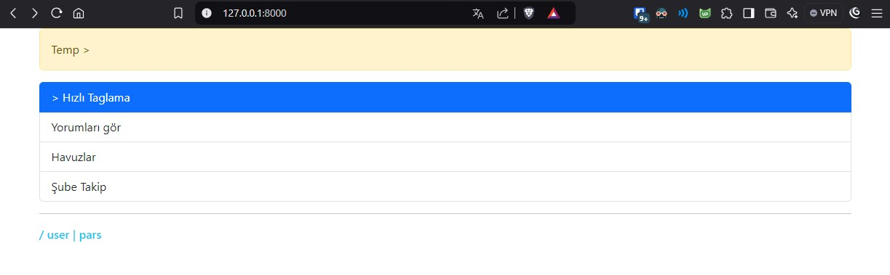

# ML based data curation data collection and organization platform 

* Considered all types of users  
* Enabled Auto Login, initially prepared for research assistants, for other users 
* Created a quick data labeling and editing page 
* Added database models to create a test pool 
* Added dataset loaders for new uploads and resets
- ---
* Developed APIs for scrapers

# Gui and others [img]

## Main page

## Data Tables

 

## Data Extraction | csv, excel, xml, json, ...

## Auth - Login 

> login with auth token 
 

## color plate

## Data Models

